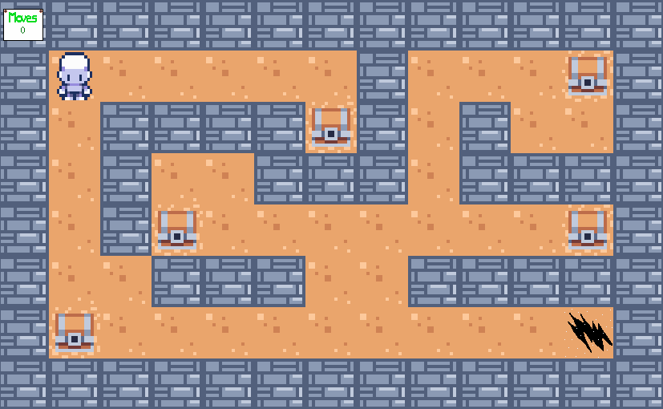

<div align="center">
  <h1>⚙️ so_long (a <a href="https://42perpignan.fr/">42</a> project) ⚙️</h1>
  
  <p>Subject (in french): <a href="fr.subject.pdf">fr.subject.pdf</a></p>
</div>
<div align="center">
  <h2>✅ Grade</h2>
  
</div><br>

## <div align="center">📄 Introduction</div>
This is the first graphic project in the 42 cursus.

It consists in creating a litle 2D video games with simple rules: there is a map in input, which gives the start position of the player, the position of the collectible items, and the exit position.

The player has to collect all of the items and to walk on the exit to finish the game. The less moves he does, the better score he obtaines.

**Bonus points are given if:**
- some sprites are animated;
- the score is displayed directly in the game's window;
- there are enemies and the player can lose if he touches one of them.

**For this project, we can use the following functions:**

> open, close, read, write, malloc, free, perror, strerror, exit
> math.h library
> MiniLibX library

All other existing functions or libraries are forbidden, and we have to use the given version of the MiniLibX, which is a small graphic library for graphic projects at 42 School.

## <div align="center">💻 Usage</div>
### <div align="center">Requirements</div>
This project will only work on linux distributions.
Type the following command on a bash terminal to install the prerequisites:
```bash
sudo apt-get install bc gcc make xorg libxext-dev libbsd-dev
```

### <div align="center">Installation</div>
Type the following commands on a bash terminal to install the program:
```bash
git clone https://github.com/Arawyn42/42_so_long
```
```bash
cd 42_so_long && make && make clean
```

## <div align="center">How to use ?</div>
```bash
./so_long maps/[map].ber
```
Replace *[map]* with the map of your choice. You can find some maps in the **maps** folder.

You can also create your own map. For this, just create a text file and name it *your_map_name*.ber
The map must be rectangular, must be surrounded by walls, and must contain the following characters:
- 1 for wall
- 0 for ground
- C for collectible items
- P for player's start position
- E for exit

It can't contain more or less than 1 player's start position and 1 exit.